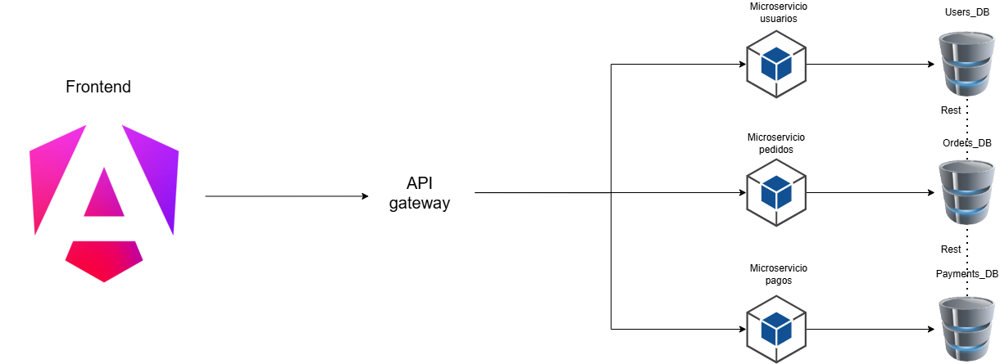

# Gestión de Pedidos ABC — MVP Migración a Microservicios

# Frontend

## Descripción general del proyecto

Se realiza el proyecto con Angular enfocado en dos vistas principales login y home.
Se utilizó una arquitectura por capas y de features para el desarrollo y para los componentes más pequeños hasta los medianos se uso Atomic Design, esto en un MVP funciona ya que como se requiere a futuro un escalado permite que las proximas pantallas a construir sea mucho más rápido ya que se tienen componentes reutilizables que solo es pasar la información. Y con la arquitectura de capas y features permite tener un front bien organizado y que se puede escalar identificando donde va cada nuevo componente y caracteristicas a implementar.

Se usaron también:
- **signal**: Para el manejo de la reactividad correcta con los servicios que usan async/await.
- **SCSS**: Por la facilidad que da manejar vistas responsives.
- **Guard**: Aunque usa datos quemados en un json se uso para la proyección de la ruta home una vez que si inicia sesión el usuario.

## Estructura del proyecto
```
src/app/
├── core/              ← Servicios singleton y guards
│   ├── services/
│   └── guards/
├── shared/            ← Todo lo reutilizable entre páginas
│   ├── components/ui/ ← Componentes "dumb" (sin lógica de negocio)
│   └── types/         ← Interfaces TypeScript
├── layouts/           ← Estructuras visuales reutilizables
└── pages/             ← Componentes "smart" (con lógica de negocio)
```

# Backend

## Descripción general del proyecto

Se presenta una propuesta indicada para el MVP proyecto ABC pensando escalabilidad y flexibilidad.
El sistema se compone por tres microservicios independientes que cubren los módulos del proyecto.
Cada microservicio expone los endpoints `/health` y `/status` para verificar su estado, y un endpoint `/mongo-health` para validar la conectividad con su base de datos.

---

## Diagrama de arquitectura



---

## Justificación de decisiones técnicas

### Comunicación entre servicios: REST

Se optó por REST sobre HTTP como modelo de comunicación entre el API Gateway y los microservicios. Porque es rápido y eficiente para implementar en una construcción de un MVP. En casos futuros ya se puede evaluar uso de mensajeria como RabbitMQ.

### Base de datos: MongoDB por servicio

Cada microservicio tiene su propia instancia de base de datos MongoDB. Para una implememntación correcta de microservicios que lo que se quiere es un bajo acoplamiento, que garantiza:

- **Autonomía**: cada servicio es independiente y puede escalarse y moverse sin interferir con el resto.
- **Aislamiento de fallos**: un error en alguna base de datos no afecta a los demás.
- **Flexibilidad de esquema**: MongoDB permite un modelo muy felxible lo que en un MVP es suficiente ya que ha medida que va creciendo el proyecto permite adaptarse a cambios muy rápido y para el manejo de pagos y transacciones proporciona un mejor rendimiento.

### Contenedores: Docker + Docker Compose

Cada microservicio tiene su propio `Dockerfile` basado en la imagen oficial de .NET 8. El archivo `docker-compose.yml` orquesta todos los servicios y la base de datos, permitiendo levantar el sistema completo con un solo comando.

### API Gateway (diseño propuesto)

Aunque no está implementado en este MVP, el API Gateway es la pieza central del diagrama. Su rol sería:

- Punto de entrada único para el frontend
- Enrutamiento de requests hacia el microservicio correspondiente
- Potencial capa de autenticación/autorización centralizada

Para una implementación real se recomendaría **YARP** (Yet Another Reverse Proxy) de Microsoft, o soluciones como **Kong** o **NGINX**, dependiendo de la complejidad operativa del equipo.

---

## Estructura del proyecto

```
gestion-pedidos-abc/
├── backend/
│   ├── users-api/          # Microservicio de usuarios
│   │   ├── Controllers/
│   │   ├── Dockerfile
│   │   └── ...
│   ├── order-api/          # Microservicio de pedidos
│   │   ├── Controllers/
│   │   ├── Dockerfile
│   │   └── ...
│   └── payment-api/        # Microservicio de pagos
│       ├── Controllers/
│       ├── Dockerfile
│       └── ...
├── docker-compose.yml
└── README.md
```

---

# Pasos para ejecutar todo el proyecto en Docker

### Requisitos previos

- Docker Desktop instalado y corriendo
- Puerto `27017`, `8001`, `8002` y `8003` disponibles en la máquina local
- Los microservicios están configurados con `ASPNETCORE_ENVIRONMENT=Development` para al momento de levantar todo lo detecte como en desarrollo y puedan usar Swagger.

### 1. Clonar el repositorio

```bash
git clone https://github.com/juanpablo152/gestion-pedidos-abc
cd gestion-pedidos-abc
```

### 2. Levantar todos los servicios

```bash
docker compose up --build
```

Este comando construye las imágenes de los tres microservicios y levanta también la instancia de MongoDB.

### 3. Verificar que los servicios están corriendo

| Servicio | Health check | Estado | Conexión a BD |
|---|---|---|---|
| users-api | http://localhost:8001/health | http://localhost:8001/status | http://localhost:8001/mongo-health |
| order-api | http://localhost:8002/health | http://localhost:8002/status | http://localhost:8002/mongo-health |
| payment-api | http://localhost:8003/health | http://localhost:8003/status | http://localhost:8003/mongo-health |

### 4. Explorar la documentación de la API (Swagger)

| Servicio | URL |
|---|---|
| users-api | http://localhost:8001/swagger/index.html |
| order-api | http://localhost:8002/swagger/index.html |
| payment-api | http://localhost:8003/swagger/index.html |

### 5. Frontend
Corre en el puerto 4200:
http://localhost:4200/login

### 5. Detener el sistema

```bash
docker compose down
```


---

